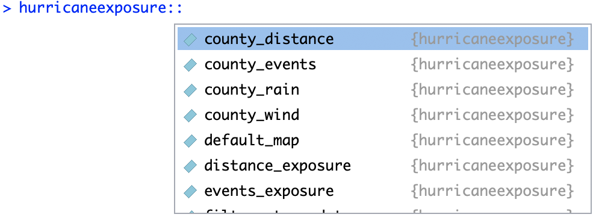

# Collect {#collect}

`r newthought("For Environmental Health researchers, I think")` one of the most exciting 
developments in R recently is how it is changing how we can collect data, both for 
exposures and outcomes. One direction for this development is how researchers can 
collect and measure original data from experiments, including through new measurement
technologies (e.g., phone-based Apps) and through new or rapidly changing health-related 
measurements (e.g., metabolomics, flow cytometry) and associated open-source 
software. 

R is also facilitating and leveraging rapid developments in how researchers can access and
query secondary data, including from large adminstrative databases, like those maintained
by the US Census, NOAA, and the USGS. This section will provide an 
introduction to some of the ideas and techniques behind these developments for 
collecting secondary or public-use data for environmental health research, as well as
give you somee directions on where to go to find R packages that facilitate collecting
open data from R.


## Data packages

With R, you can create packages that are exclusively or mainly created to share data. 
Some researchers are creating and publishing this type of "data package", and some
may be relevant to your research. These packages provide access to open datasets that the 
package maintainer collected and processed and is now making available as an R package, 
but the data is static (as of the last version of the package), rather than interfacing
to pull the most recent data. However, this set-up can achieve more stability---it won't 
be broken by a change in an online API. 

This package is too big for CRAN to host, so we have it posted through our own package
repository.^[For more on how and why we did this, see 
[an article](https://journal.r-project.org/archive/2017/RJ-2017-026/) we wrote about the
process for **The R Journal**.] Because of this, you'll need to take a few extra steps
to download and install the package:^[If you don't have the `drat` package, install it in 
the usual way with `install.packages("drat")`.] 

```{r eval = FALSE}
library(drat)
addRepo("geanders")
install.packages("hurricaneexposuredata")
install.packages("hurricaneexposure")
```

Once you've installed both the `hurricaneexposuredata` and `hurricaneexposure` packages, you 
can load them as usual to access both the data and some functions to work with them:

```{r}
library(hurricaneexposuredata)
library(hurricaneexposure)
```

The `hurricaneexposure` package has a series of functions that let you explore different
exposures during storms. For example, to get the storms where either New York County, NY, 
or Suffolk County, MA, (which includes Boston) were exposed to tropical storm-level winds
(17.5 m/s or higher), you can run:^[For any of these functions, you can find out what parameters
to include, and in what format, but opening the helpfile for the function. For example, once you've
loaded the `hurricaneexposure` package, you can open the helpfile for the `county_wind` function
by calling `?county_wind`. Also helpful for navigating packages: take advantage of the `package::function`
notation and RStudio's tab completion to look up the names of functions in a package. For example, 
type `hurricaneexposure::`. A pop-up window should show up with all the functions in the package (press
Tab if the pop-up doesn't automatically open).]

```{r fig.margin = TRUE}

```


```{r}
county_wind(counties = c("36061", "25025"),
            start_year = 1988, end_year = 2015, 
            wind_limit = 17.5)
```

If you look up events based on flood events, you can instead run the
`county_events` function:

```{r}
county_events(counties = c("36061", "25025"),
             start_year = 1996, end_year = 2015, 
             event_type = "flood")
```

The `hurricaneexposure` package also has functions for mapping the exposure 
data for specific storms. For example, to see the rainfall fro Hurricane Ivan in 
2004, you can run:

```{r fig.fullwidth = TRUE}
map_counties(storm = "Ivan-2004", metric = "rainfall")
```

From this map, you can see that the rain from this storm extended into New
England, even after the storm looped back around to the east and south. This is
why New York City had heavy rainfall (and flooding) from this event, but not
tropical storm-level winds.

For more on the `hurricaneexposure` package, see [its vignette](https://cran.r-project.org/web/packages/hurricaneexposure/vignettes/hurricaneexposure.html).

## Open data APIs

A range of environmental datasets are available online, especially through national agencies. 
For example, NOAA provides various weather datasets, while USGS has data on water quality, 

You can visit webpages hosted by these agencies where you can download the datasets you need. 
However, this process can become tedious if you need lots of datasets, as may be the case for 
large studies incorporating many cities. Further, downloading the datasets "by hand" is hard 
to make reproducible, unless you meticiously write down all the steps you took as you visited 
the website. This means that your process will be harder for you to repeat in the future
or for others to replicate. 

A growing collection of R packages are now available that allow you to download datasets 
available online directly from R. This means that you can write an R script for your data
collection, making this step both better documented and more reproducible. 

One great example is the `tigris` package. This package lets you pull
spatial data into R directly from the US Census. To get spatial data for all the counties in 
Florida, you can run:

```{r eval = FALSE}
library(tigris)
fl_counties <- counties(state = "FL",
                        class = "sf")
```
```{r echo = FALSE}
load("data/fl_counties.RData")
```

Now you can plot this data with `ggplot`: 

```{r fig.align = "center"}
library(ggplot2)
ggplot() + 
  geom_sf(data = fl_counties, 
          aes(fill = ALAND)) + 
  theme_bw() + 
  scale_fill_viridis_c(name = "Land area", label = scales::scientific) + 
  theme(axis.text = element_blank(),
        axis.ticks = element_blank())
```


## Learn more

One of the best places to explore R packages for accessing open data for science is 
[ROpenSci](https://ropensci.org/).
Many of its packages facilitate access to databases of open data relevant to scientific
research that have web services. You can browse through its packages on 
its [Packages page](https://ropensci.org/packages/). You may also want to 
check its affiliated [Journal of Open-Source Software](https://joss.theoj.org/).
Authors of these packages will also sometimes publish associated articles in 
[The R Journal](https://journal.r-project.org/), so it's worth browsing through
that occasionally. 
Finally, Twitter is a great place ot keep an eye out for new packages, including
those that can help you collect data. Follow the "#rstats" tag.