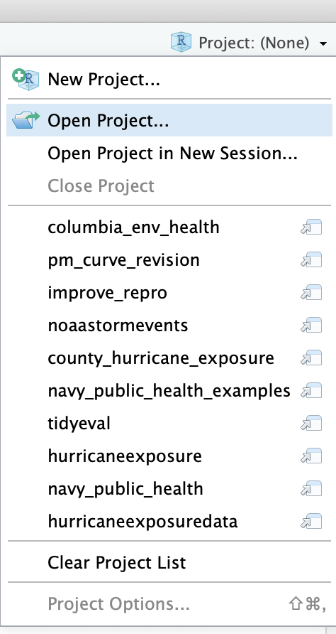
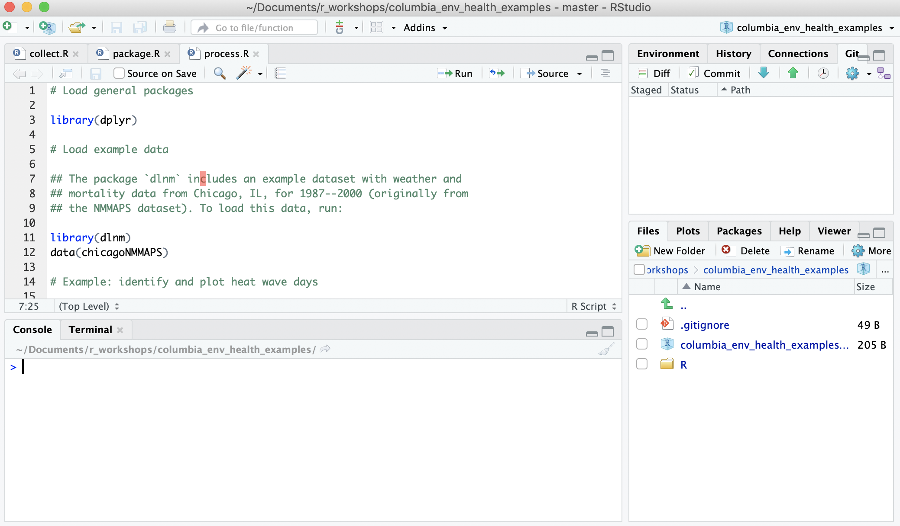
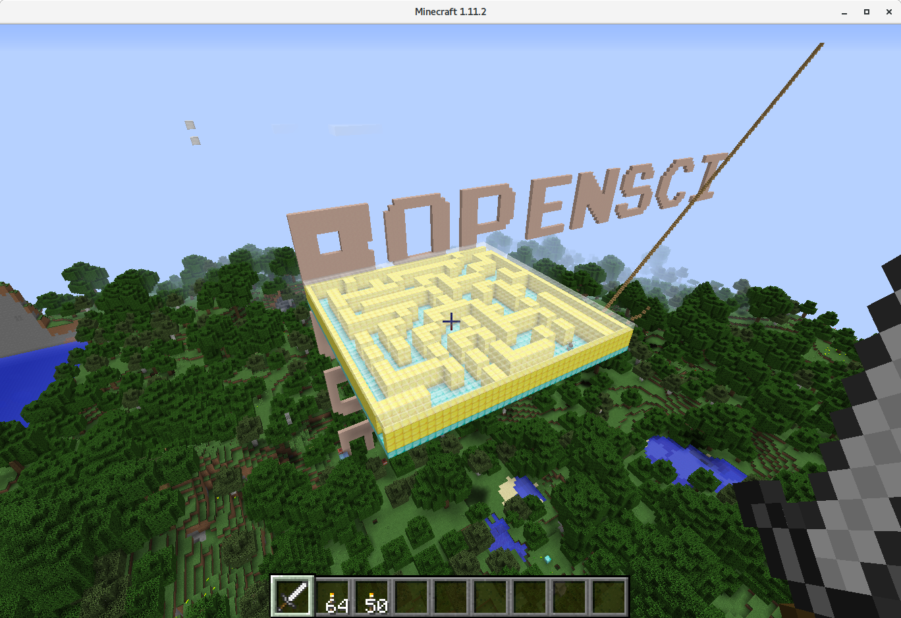
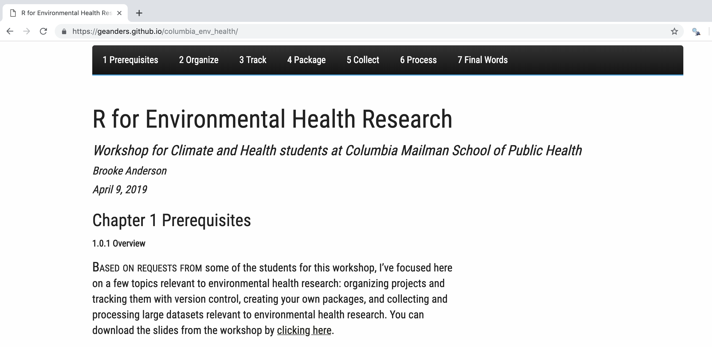

```{r echo = FALSE, message = FALSE, warning = FALSE}
knitr::opts_knit$set(root.dir = "..")
library(dplyr)
library(ggplot2)
```


## Today's goals

- LEARN principles of a key R plotting framework \bigskip
- UNDERSTAND what R can do for visualizations \bigskip
- KNOW what to do next to learn more

## Homework?!

\begin{center}
\url{https://bit.ly/2WQV6XT}
\end{center}

## Today's plan

\montserratfont
- \largetext{ORGANIZE} \bigskip
- \largetext{TRACK} \bigskip
- \largetext{PACKAGE} \bigskip
- \largetext{COLLECT} \bigskip
- \largetext{PROCESS} 

____

\begin{center}
 \hugetext{PREREQUISITES} 
 \medskip 
 \small Setting up 
\end{center}

## Install RStudio Desktop

\centering

\large https://www.rstudio.com/

## Install git

\centering

\large https://git-scm.com/downloads

## Create GitHub account

\centering

\large https://github.com/

## Download example project

\centering

\large https://github.com/geanders/columbia_env_health_examples

____

\begin{center}
 \hugetext{ORGANIZE} 
 \medskip 
 \small Setting up 
\end{center}

____

\begin{center}
 \largetext{One project : One directory} \\
 \medskip 
 \small \textbf{Rule \#1} of research project file organization 
\end{center}

____

\begin{center}
 \largetext{Use consistent names} \\
 \medskip 
 \small \textbf{Rule \#2} of research project file organization
\end{center}

____

\begin{center}
 \largetext{Use relative filenames} \\
 \medskip 
 \small \textbf{Rule \#3} of research project file organization
\end{center}

____

## Common project subdirectories

- **data-raw** Raw data and R scripts to clean the raw data. \medskip
- **data** Cleaned data, often saved as `.RData` after being generated by a script in `data-raw`. \medskip
- **R** Code for any functions used in analysis. \medskip
- **figures** Figures created from R code. \medskip
- **reports** R Markdown files and products rendered from those files (e.g., paper drafts, presentations).

## Create R project

\begin{columns}
\begin{column}{0.3\textwidth}
\includegraphics[height = 0.7\textheight]{images/create_r_project}
\end{column}
\begin{column}{0.6\textwidth}
\includegraphics[width = \textwidth]{images/selecting_r_project}
\end{column}
\end{columns}

## Navigating R Projects

```{r echo = FALSE, out.width = "0.4\\textwidth", fig.align = "center"}

```

## Navigating R Projects

```{r echo = FALSE, out.width = "0.99\\textwidth", fig.align = "center"}

```


____

\tikz[overlay,remember picture] \node[opacity=0.2, at=(current page.center)]{%
  \includegraphics[width=1\paperwidth]{images/hidden_files}};
\color{colorblue}
\begin{center}
\hugetext{\montserratfont .Rproj/}
\end{center}

## Resources

```{r echo = FALSE, out.height = "0.8\\textheight", fig.align = "center"}
knitr::include_graphics("images/repro_research_book.jpeg")
```

____

\tikz[overlay,remember picture] \node[opacity=0.2, at=(current page.center)]{%
  \includegraphics[width=1\paperwidth]{images/example_code}};
\color{colorblue}
\begin{center}
\hugetext{\montserratfont [Live coding example]}
\end{center}


____

\begin{center}
 \hugetext{TRACK} 
 \medskip 
 \small \textbf{git and GitHub} for version control
\end{center}

____

\tikz[overlay,remember picture] \node[opacity=0.2, at=(current page.center)]{%
  \includegraphics[width=1\paperwidth]{images/hidden_files}};
\color{colorblue}
\begin{center}
\hugetext{\montserratfont .git/}
\end{center}

## Using GitHub to collaborate

```{r echo = FALSE, out.width = "0.9\\textwidth", fig.align = "center"}

```

\center
\url{https://github.com/ropenscilabs/miner}

## Hosting content with GitHub Pages

```{r echo = FALSE, out.width = "\\textwidth", fig.align = "center"}

```

____

\tikz[overlay,remember picture] \node[opacity=0.2, at=(current page.center)]{%
  \includegraphics[width=1\paperwidth]{images/example_code}};
\color{colorblue}
\begin{center}
\hugetext{\montserratfont [Live coding example]}
\end{center}

____

\begin{center}
 \hugetext{PACKAGE} 
 \medskip 
 \small Collect R functions in \textbf{packages} 
\end{center}

____

\includegraphics[width = \textwidth]{images/CRAN_package_10000}

## Resources

```{r echo = FALSE, out.height = "0.7\\textheight", fig.align = "center"}
knitr::include_graphics("images/p_packages_cover.png.png")
```

\centering
http://r-pkgs.had.co.nz/

____

\tikz[overlay,remember picture] \node[opacity=0.2, at=(current page.center)]{%
  \includegraphics[width=1\paperwidth]{images/example_code}};
\color{colorblue}
\begin{center}
\hugetext{\montserratfont [Live coding example]}
\end{center}

____

\begin{center}
 \hugetext{COLLECT} 
 \medskip 
 \small Leverage \textbf{open data} tools for collecting data
\end{center}

## Data packages

\footnotesize

```{r}
library(hurricaneexposure)
county_wind(counties = "36061", 
            start_year = 1988, end_year = 2015, 
            wind_limit = 17.5) %>% 
  select(storm_id, vmax_sust, storm_dist, closest_date)
```

## Data packages

\footnotesize

```{r}
county_events(counties = "36061", 
              start_year = 1988, end_year = 2015, 
              event_type = "flood") %>% 
  select(storm_id, storm_dist, closest_date)
```

## Data packages

\footnotesize

```{r fig.width = "6in", out.width = "0.9\\textwidth"}
map_counties(storm = "Ivan-2004", metric = "rainfall")
```


## Open Data APIs

```{r eval = FALSE}
library(tigris)
fl_counties <- counties(state = "FL",
                        class = "sf")
```
```{r echo = FALSE}
load("data/fl_counties.RData")
```

```{r echo = FALSE, out.height = "0.5\\textheight", fig.align = "center", fig.width = 4}
ggplot() + 
  geom_sf(data = fl_counties, 
          aes(fill = ALAND)) + 
  theme_bw() + 
  scale_fill_viridis_c(name = "Land area", label = scales::scientific) + 
  theme(axis.text = element_blank(),
        axis.ticks = element_blank())
```

____

\tikz[overlay,remember picture] \node[opacity=0.2, at=(current page.center)]{%
  \includegraphics[width=1\paperwidth]{images/example_code}};
\color{colorblue}
\begin{center}
\hugetext{\montserratfont [Live coding example]}
\end{center}

____

\begin{center}
 \hugetext{PROCESS} 
 \medskip 
 \small Find and make \textbf{R packages} for processing data
\end{center}

____

\tikz[overlay,remember picture] \node[opacity=0.2, at=(current page.center)]{%
  \includegraphics[width=1\paperwidth]{images/example_code}};
\color{colorblue}
\begin{center}
\hugetext{\montserratfont [Live coding example]}
\end{center}

## Homework!!

\begin{center}
\url{https://bit.ly/2WQV6XT}
\end{center}

