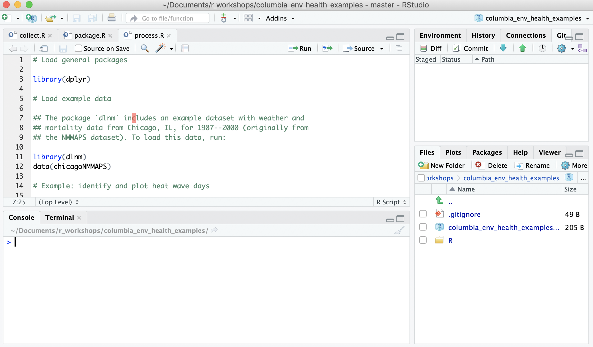

--- 
title: "R for Environmental Health Research"
subtitle: "Workshop for Climate and Health students at Columbia Mailman School of Public Health"
author: "Brooke Anderson"
date: "April 9, 2019"
site: bookdown::bookdown_site
output:
  bookdown::tufte_html_book:
    toc: yes
    css: toc.css
    tufte_variant: "envisioned"
  bookdown::tufte_book2:
    toc: yes
    includes:
      in_header: preamble.tex
documentclass: book
bibliography: [book.bib, packages.bib]
biblio-style: apalike
link-citations: yes
github-repo: rstudio/bookdown-demo
description: "Online booklet for workshop on R for environmental health research, geared to those who already use R for their research but want to learn more tools."
---

```{r include = FALSE}
library(tufte)
library(knitr)
```

# Prerequisites

`r newthought("Based on requests from ")` some of the students for this
workshop, I've focused here on a few topics relevant to environmental health
research: organizing projects and tracking them with version control, creating
your own packages, and collecting and processing large datasets relevant to
environmental health research. You can download the slides from the workshop by
[clicking
here](https://github.com/geanders/columbia_env_health/raw/master/_workshop_slides/workshop_slides.pdf).

There are some additional topics in R that would also be useful for
environmental health researchers that I won't cover here. I would, however,
suggest that you look at the latest on tidyverse functions for cleaning and
visualizing data (the `dplyr` and `ggplot2` packages are at the heart of this),
new developments on working with geospatial data with the `sf` package, creating
interactive graphics with `htmlwidgets`, and creating reports, blogs, and books
through the `rmarkdown` framework. In the conclusion to this booklet, I'll
provide some references for learning more about all of these topics.

Click on the **Next** button (or navigate using the
links at the top of the page) to continue.

## Set-up

I am assuming that you already have R and RStudio installed on your computer.
You may want to check that you have a recent version of both, and if not, update
you version before the workshop. Some of the packages and RStudio tools we'll be
using will require newer versions of R and RStudio to work. You can run
`sessionInfo()` in R to find out the version of R you have installed. Compare
this version to the latest R release version listed at the **Comprehensive R
Archive Network (CRAN)**^[**Comprehensive R Archive Network (CRAN).** ...]

To try out the examples, you will also need a bit more set-up: 

1. Download git
2. Get a GitHub account
3. Install some R packages
4. Download example R Project

This section will walk you through each step. 

1. Download git

In the workshop, you will learn how to use **git**.[^**git.** Open-source version control
software ...] To try the examples, you will need to install git to your computer and make 
sure that your installation of RStudio can find this software, so you can use git for version
control for R Projects. ...

2. Get a GitHub account

You'll also learn how to share and collaborate on an R Project using **GitHub**.^[**GitHub.**
An online platform for directories tracked with 
the version control software `git`. This platform has become 
very popular for sharing code projects, as well as collaborating across a team on developing
code and software. Other online git platforms exist and are used by some researchers, 
including **GitLab**. Once you've mastered using GitHub, you should be able to easy 
transfer those skills to other platforms like GitLab.] You will need to get a GitHub 
account to be able to post repositories on GitHub. ...

3. Install some R packages

This booklet uses a number of R packages beyond base R. To install all the packages that you'll
need, run the following code in your version of R: 

```{r eval = FALSE}
install.packages(c("readr", "ggplot2", "forcats", "magrittr", 
                   "dplyr", "lubridate", "sf", "tigris",
                   "DT", "plotly", "leaflet", "flexdashboard", 
                   "tidyr", "stringr"))
```

4. Download example R Project

I've created a repository on GitHub. You can find this example
repository by [clicking here](https://github.com/geanders/columbia_env_health_examples). On the
page takes you to, click on the "Clone or download" button and then select "Download ZIP". 

This will download a single zipped file to your computer. When you unzip the file, it will be a
special type of directory, an R Project directory. To open the R Project and start on the 
examples, open RStudio, then go to "File" -> "Open Project". A pop-up window will open to let you 
navigate through your files and find an R Project to open. Navigate to the directory you 
downloaded, which should be called "columbia_env_health_examples" and doubleclick on the file 
in this directory called "columbia_env_health_examples.Rproj". 

This will open the project. In the "Files" pane of RStudio, you should see some subdirectories for
"R" and "data". These have the example R code and data, respectively, for you to try the examples
in this booklet. The code in each of the R files should run independently, including the code to 
load all required packages. Figure \@ref(fig:examplerepo) shows what this package should 
look like once you've downloaded and opened it, as well as some of the files in the 
project's "R" subdirectory.

```{r examplerepo, fig.fullwidth = TRUE, echo = FALSE, fig.cap = "What the example R Project for this booklet should look like once you've downloaded and opened it."}

```


```{r include=FALSE}
# automatically create a bib database for R packages
knitr::write_bib(c(
  .packages(), 'bookdown', 'knitr', 'rmarkdown', 'ggplot2', 'readr',
  'forcats', 'magrittr', 'dplyr', 'sf', 'htmlwidgets', 'DT', 'plotly', 
  'leaflet', 'flexdashboard', 'usethis', 'devtools'
), 'packages.bib')
```

